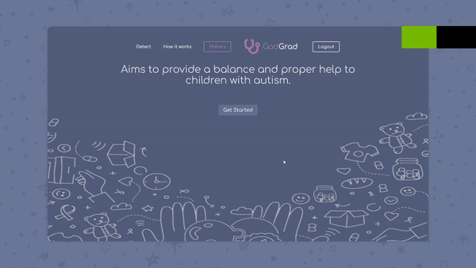

# Autism Detector :man_health_worker:

### Project Objective

This project was about creating a web app that allows parents, caregivers, or healthcare providers to input data on
a child (Images), which is analyzed by a TensorFlow model trained to detect
autism patterns.

#### Used Tech
- Flask (Python)
- Machine Learning (Python)
- MongoDB (NoSQL)
- HTML
- CSS
- Vanilla JavaScript

### Demo

